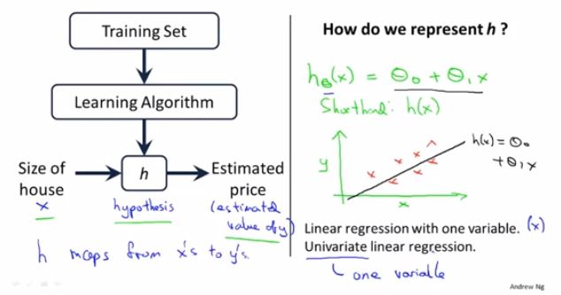
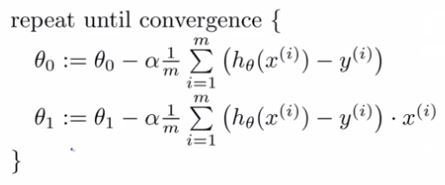

符号
m：训练样本的数量。 
x：输入变量/特征。 
y：输出变量/目标变量。 
(x,y)：一个训练样本。 
$(x^{(i)},y^{(i)})$：第i个训练样本。 

假设函数：$h_ \theta (x)= \theta _0 + \theta _1 x$ 
模型参数：$\theta_i$ 
代价函数：$J(\theta_0,\theta_1) = \frac {1} {2m} \sum^{m}_{i=1}(h_\theta(x^{(i)}-y^{(i)}))^2$ 
优化目标：$minimize_{\theta_0,\theta_1}J(\theta_0,\theta_1)$ 
### 梯度下降法
假设只有$\theta_0和\theta_1$
$$
\alpha :学习率数字，每步迈多大
$$

$$
\theta_j := \theta_j - \alpha \frac{\partial J(\theta_0,\theta_1)}{\partial\theta_j}　(j = 0,1)
$$
注：$\theta_0,\theta_1$需要同时更新，
因此，需要先存储$\theta_0,\theta_1$到temp0,temp1，之后在统一赋值。 
