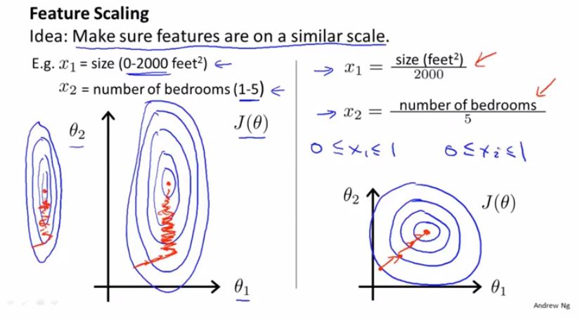
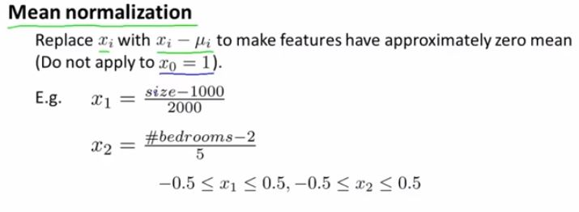
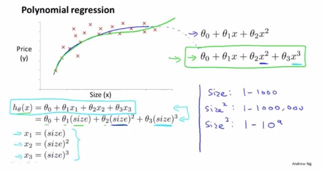
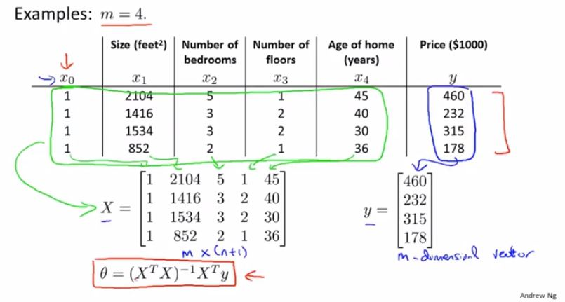

## 多元线性回归
n：特征量数目/自变量数目
$x^{(i)}$：第i个训练样本输入特征值
$x^{(i)}_j$：第i个训练样本中，第j个特征量的值
线性回归假设
$$
x=
\begin{bmatrix}
x_0 \\
x_1 \\
\vdots \\
x_n
\end{bmatrix}
\in \mathbb{R}^{n+1}　　
\theta=
\begin{bmatrix}
\theta_0 \\
\theta_1 \\
\vdots \\
\theta_n
\end{bmatrix}
\in \mathbb{R}^{n+1}
$$

$令x_0^{(i)}=1，则$

$$
\begin{aligned}
h_\theta(x)
&=\theta_0x_0+\theta_1x_1+\theta_2x_2+...+\theta_nx_n \\
&=\theta^T x 
\end{aligned}
$$
## 多元梯度下降法
假设函数：$h_\theta(x)=\theta_0x_0+\theta_1x_1+\theta_2x_2+...+\theta_nx_n$</br>
模型参数：$\theta_0,\theta_1,...,\theta_n$　
即$\theta(n+1维向量)$</br>
代价函数：$J(\theta)=J(\theta_0,\theta_1,...,\theta_n) = \frac {1} {2m} \sum^{m}_{i=1}(h_\theta(x^{(i)}-y^{(i)}))^2$</br>
梯度下降法：

$\begin{aligned}
\theta_j &:= \theta_j - \alpha \frac{\partial J(\theta)}{\partial\theta_j} \\
&:=\theta_j - \alpha \frac{1}{m}\sum^m_{i=1}(h_\theta(x^{(i)})-y^{(i)})x_j^{(i)}
\end{aligned}
$
## 特征缩放
如图，用 $\alpha x_i来替换x_i$ ，将特征值的范围进行缩放，可以提高效率，特征值的范围不宜太大，也不宜太小，一般来说，控制在个位数就好。

## 均值归一化
如图，用 $x_i-\mu_i来替换x_i$ ，将特征值的平均值调为0。


>一般地，用$\frac{x_i-\mu_i}{s_i}来替换x_i$ ，其中，$\mu_i$为特征$x_i$的平均值，$s_i$为特征$x_i$的范围。

## 学习率$\alpha$的选择
自动收敛测试：如，设$\epsilon =\Delta J(\theta) \leq10^{-3}$，
但是$\epsilon$的选择会比较困难。</br>
推荐通过画出$J(\theta)$随次数变化的图像，来观察是否收敛。
可以尝试各种不同的$\alpha$值，如...,　0.001,　0.003,　0.01,　0.03　,0.1,,　0.3,　1，...每隔3倍取一个值
## 多项式回归
如图，在进行函数拟合过程中，可能使用的并不是一条直线，而是其他函数，但是要注意特征的缩放。

## 正规方程
使用正规方程法，不需要进行特征缩放。

设有m个训练样本$(x^{(1)},y^{(1)}),...,(x^{(m)},y^{(m)})$；
n个特征变量
$$
x^{(i)}=
\begin{bmatrix}
x_0^{(i)} \\
x_1^{(i)} \\
\vdots \\
x_n^{(i)}
\end{bmatrix}
\in \mathbb{R}^{n+1}
$$
$$
设计矩阵　X=
\begin{bmatrix}
\cdots (x^{(1)})^T \cdots \\
\cdots (x^{(2)})^T \cdots\\
\vdots \\
\cdots (x^{(m)})^T \cdots
\end{bmatrix}
　
y=
\begin{bmatrix}
y^{(1)} \\
y^{(2)} \\
\vdots \\
y^{(m)}
\end{bmatrix}
\in \mathbb{R}^{m}
$$
$\theta=(X^TX)^{-1}X^Ty$
```
Octave:
pinv(x'*x)*x'*y
注：pinv(x)是x的逆矩阵
x'是x的转置
```
假设有m个训练样本和n个特征变量。</br>
梯度下降法：</br>
优点：当特征变量n过大时，仍能很好的工作。</br>
缺点：需要$\alpha$；需要多次迭代。
正规方程法：</br>
优点：不需要$\alpha$；不需要多次迭代。</br>
缺点：当n大于等于10,000时会变得很慢。